<div align="center">

# 📚 BookLore

### *Your Personal Library, Beautifully Organized*

<p align="center">
  
</p>

[](https://github.com/adityachandelgit/BookLore/releases)
[](LICENSE)
[](https://github.com/adityachandelgit/BookLore/stargazers)
[](https://hub.docker.com/r/booklore/booklore)

[](https://discord.gg/Ee5hd458Uz)
[](https://opencollective.com/booklore)

---

**BookLore** is a powerful, self-hosted web application designed to organize and manage your personal book collection with elegance and ease. Build your dream library with an intuitive interface, robust metadata management, and seamless multi-user support.

[🚀 Get Started](#-getting-started-with-booklore) • [📖 Documentation](https://booklore-app.github.io/booklore-docs/) • [🎮 Try Demo](#-live-demo-explore-booklore-in-action) • [💬 Community](https://discord.gg/Ee5hd458Uz)

</div>

---

<div align="center">

## ✨ **Features That Make BookLore Shine**

</div>

<table>
<tr>
<td width="50%">

### 📖 **Library Management**

- **Smart Organization**: Custom shelves with powerful filters
- **Magic Shelves**: Dynamic, auto-updating collections
- **Auto Metadata**: Rich details from multiple sources
- **Advanced Search**: Find any book instantly

</td>
<td width="50%">

### 🌐 **Connectivity**

- **Kobo Integration**: Seamless device sync
- **OPDS Support**: Connect any reading app
- **KOReader Sync**: Cross-platform progress tracking
- **Email Sharing**: One-click book sending

</td>
</tr>
<tr>
<td width="50%">

### 👥 **User Experience**

- **Multi-User Support**: Granular permissions
- **Flexible Auth**: Local or OIDC providers
- **Mobile Ready**: Responsive on all devices
- **Built-in Reader**: PDFs, EPUBs, comics

</td>
<td width="50%">

### 🚀 **Smart Features**

- **BookDrop Import**: Auto-detect bulk files
- **Private Notes**: Personal reading annotations
- **Community Reviews**: Enriched book data
- **Progress Tracking**: Reading statistics

</td>
</tr>
</table>

---

<div align="center">

## 💖 **Support the Project**

</div>

<div align="center">

Your support helps BookLore grow and improve! 🌱

<table>
<tr>
<td align="center" width="33%">

### ⭐ **Star Us**

Give us a star to show your support and help others discover BookLore!

[](https://github.com/adityachandelgit/BookLore)

</td>
<td align="center" width="33%">

### 💰 **Sponsor**

Support development, hosting, and testing costs

[](https://opencollective.com/booklore)

</td>
<td align="center" width="34%">

### 📢 **Spread the Word**

Share BookLore with fellow book lovers and developers!

</td>
</tr>
</table>

> 🎯 **Current Goal:** Raising funds for a **Kobo device** to implement native Kobo sync support  
> [💡 Support the Kobo Sync Bounty →](https://opencollective.com/booklore/projects/kobo-device-for-testing)

</div>

---

<div align="center">

## 🎮 **Live Demo: Explore BookLore in Action**

</div>

<div align="center">

Experience BookLore's features in a live environment before deploying your own instance!

| 🌐 Demo URL                                        | 👤 Username | 🔑 Password        |
|----------------------------------------------------|-------------|--------------------|
| **[demo.booklore.dev](https://demo.booklore.dev)** | `booklore`  | `9HC20PGGfitvWaZ1` |

> ⚠️ **Note:** Demo account has standard user permissions only.  
> Admin features (user management, library setup) require a self-hosted instance.

</div>

---

<div align="center">

## 🚀 **Getting Started with BookLore**

### Choose Your Path

<table>
<tr>
<td align="center" width="50%">

### 📘 **Documentation**

Guides for installation, setup, features, and more

[](https://booklore-app.github.io/booklore-docs/docs/getting-started/)

*Contribute to the docs at: [booklore-docs](https://github.com/booklore-app/booklore-docs)*

</td>
<td align="center" width="50%">

### 🐳 **Quick Deploy**

Get up and running in minutes with Docker

[](#-deploy-with-docker)

*Easiest way to self-host BookLore*

</td>
</tr>
</table>

</div>

---

<div align="center">

## 🐳 **Deploy with Docker**

</div>

### **Prerequisites**

Ensure you have [Docker](https://docs.docker.com/get-docker/) and [Docker Compose](https://docs.docker.com/compose/install/) installed.

<details>
<summary><b>📦 Image Repositories</b></summary>

- 🐳 **Docker Hub:** `booklore/booklore`
- 📦 **GitHub Container Registry:** `ghcr.io/booklore-app/booklore`

> 💡 Legacy images at `ghcr.io/adityachandelgit/booklore-app` remain available but won't receive updates.

</details>

### **Step 1️⃣: Create Environment Configuration**

Create a `.env` file in your project directory:

```ini
# 🎯 BookLore Application Settings
APP_USER_ID=0
APP_GROUP_ID=0
TZ=Etc/UTC
BOOKLORE_PORT=6060

# 🗄️ Database Connection (BookLore)
DATABASE_URL=jdbc:mariadb://mariadb:3306/booklore
DB_USER=booklore
DB_PASSWORD=ChangeMe_BookLoreApp_2025!

# 🔧 MariaDB Container Settings
DB_USER_ID=1000
DB_GROUP_ID=1000
MYSQL_ROOT_PASSWORD=ChangeMe_MariaDBRoot_2025!
MYSQL_DATABASE=booklore
```

### **Step 2️⃣: Create Docker Compose File**

Create a `docker-compose.yml` file:

```yaml
services:
  booklore:
    image: booklore/booklore:latest
    # Alternative: Use GitHub Container Registry
    # image: ghcr.io/booklore-app/booklore:latest
    container_name: booklore
    environment:
      - USER_ID=${APP_USER_ID}
      - GROUP_ID=${APP_GROUP_ID}
      - TZ=${TZ}
      - DATABASE_URL=${DATABASE_URL}
      - DATABASE_USERNAME=${DB_USER}
      - DATABASE_PASSWORD=${DB_PASSWORD}
      - BOOKLORE_PORT=${BOOKLORE_PORT}
    depends_on:
      mariadb:
        condition: service_healthy
    ports:
      - "${BOOKLORE_PORT}:${BOOKLORE_PORT}"
    volumes:
      - ./data:/app/data
      - ./books:/books
      - ./bookdrop:/bookdrop
    restart: unless-stopped

  mariadb:
    image: lscr.io/linuxserver/mariadb:11.4.5
    container_name: mariadb
    environment:
      - PUID=${DB_USER_ID}
      - PGID=${DB_GROUP_ID}
      - TZ=${TZ}
      - MYSQL_ROOT_PASSWORD=${MYSQL_ROOT_PASSWORD}
      - MYSQL_DATABASE=${MYSQL_DATABASE}
      - MYSQL_USER=${DB_USER}
      - MYSQL_PASSWORD=${DB_PASSWORD}
    volumes:
      - ./mariadb/config:/config
    restart: unless-stopped
    healthcheck:
      test: [ "CMD", "mariadb-admin", "ping", "-h", "localhost" ]
      interval: 5s
      timeout: 5s
      retries: 10
```

### **Step 3️⃣: Launch BookLore**

```bash
docker compose up -d
```

### **Step 4️⃣: Access Your Library**

Open your browser and navigate to:

**🌐 http://localhost:6060**

🎉 **Welcome to your personal library!**

---

<div align="center">

## 📥 **BookDrop: Automatic Import**

### *Drop Files, Import Automatically*

</div>

BookLore's **BookDrop** feature automatically detects and processes book files dropped into a designated folder.

### **How It Works**

```mermaid
graph LR
    A[📁 Drop Files] --> B[🔍 Auto-Detect]
    B --> C[📊 Extract Metadata]
    C --> D[✅ Review & Import]
```



1. **File Watcher**: Monitors the BookDrop folder continuously
2. **Auto-Detection**: Processes new files and extracts metadata
3. **Metadata Enrichment**: Fetches details from Google Books, Open Library
4. **Review & Finalize**: Review, edit, and import to your library

### **Docker Configuration**

Add the BookDrop volume to your `docker-compose.yml`:

```yaml
services:
  booklore:
    volumes:
      - ./data:/app/data
      - ./books:/books
      - ./bookdrop:/bookdrop  # 👈 BookDrop magic happens here
```

---

<div align="center">

## 🤝 **Community & Support**
<table>
<tr>
<td align="center">

### 🐞 **Bug Reports**

Found an issue?

[](https://github.com/booklore-app/booklore/issues)

</td>
<td align="center">

### 💡 **Feature Req**

Have an idea?

[](https://github.com/booklore-app/booklore/issues/new?template=feature_request.md)

</td>
<td align="center">

### 🤝 **Contribute**

Join development!

[](CONTRIBUTING.md)

</td>
<td align="center">

### 💬 **Chat**

Join community!

[](https://discord.gg/Ee5hd458Uz)

</td>
</tr>
</table>

</div>


---

<div align="center">

## 📊 **Project Analytics**

### Repository Activity


### ⭐ Star History

<a href="https://www.star-history.com/#booklore-app/booklore&type=date&legend=top-left">
 <picture>
   <source media="(prefers-color-scheme: dark)" srcset="https://api.star-history.com/svg?repos=booklore-app/booklore&type=date&theme=dark&legend=top-left" />
   <source media="(prefers-color-scheme: light)" srcset="https://api.star-history.com/svg?repos=booklore-app/booklore&type=date&legend=top-left" />
   
 </picture>
</a>

</div>

---

<div align="center">

## 👨‍💻 **Contributors**

### Thanks to all our amazing contributors! 🙏

[](https://github.com/adityachandelgit/BookLore/graphs/contributors)

**Want to see your face here?** [Start contributing today!](CONTRIBUTING.md)

</div>

---

<div align="center">

## ⚖️ **License**

**GNU General Public License v3.0**

Copyright © 2024-2025 BookLore

[](http://www.gnu.org/licenses/gpl.html)

---

<sub>Made with ❤️ by the BookLore community</sub>

**[⬆ Back to Top](#-booklore)**

</div>
